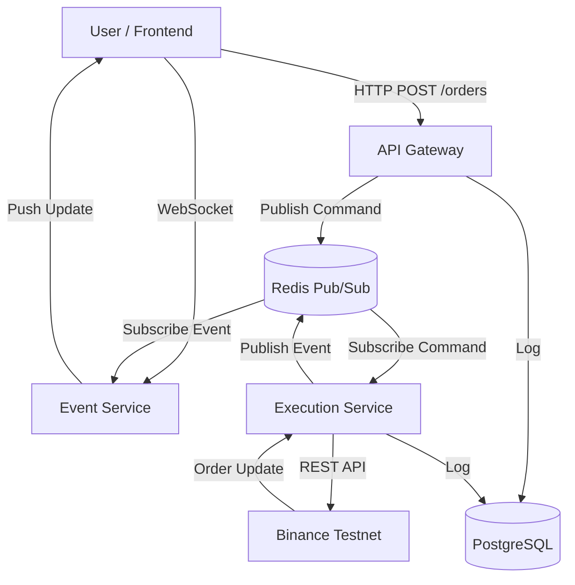

# Real-Time Trading Platform (Testnet)

[](https://classroom.github.com/a/AZ80UqO2)

A full-stack, real-time cryptocurrency trading platform built with event-driven architecture. This system demonstrates microservices design, WebSocket-based real-time updates, and proper separation of concerns for scalable trading applications.

**TESTNET ONLY:** This platform uses Binance Testnet and virtual funds. Not for production use.

---

## 🎥 Demo Video

**[Watch Demo Video Here](#)** *(Replace with your YouTube demo link)*

---

## 🚀 Live Deployment

- **Frontend:** https://your-frontend-url.vercel.app  
- **Backend API:** https://your-backend-url.railway.app  

---

## 🏗️ Architecture Overview

### System Design Diagram



---

### Key Architectural Decisions

#### 1. Event-Driven Architecture (Redis Pub/Sub)

- **Decision:** Decoupled order placement from execution using Redis.
- **Reasoning:** Prevents the API from blocking during external calls to Binance.
- **Trade-off:** Asynchronous state handling adds complexity but improves scalability.

#### 2. Separate Execution Service

- **Decision:** Isolated Binance communication in a dedicated worker.
- **Reasoning:** Allows independent scaling and isolates third-party latency or rate limits.

#### 3. Event Broadcasting Service (WebSocket)

- **Decision:** Dedicated WebSocket service for real-time updates.
- **Reasoning:** WebSockets are stateful and resource-intensive; isolation avoids API slowdown.
- **Optimization:** Single WebSocket connection per user for all updates.

#### 4. Monorepo Structure

- **Decision:** Used NPM Workspaces.
- **Reasoning:** Enables shared TypeScript types across frontend and backend for end-to-end type safety.

---

## 📁 Repository Structure

```
trading-platform/
├── apps/
│   ├── backend/              # Express.js API Gateway
│   ├── execution-service/    # Order execution worker
│   ├── event-service/        # WebSocket real-time service
│   └── frontend/             # Next.js 14 UI
│
├── packages/
│   └── shared/               # Shared TypeScript types
│
├── docker-compose.yml        # Local infrastructure
└── README.md
```

---

## 🛠️ Setup Instructions

### Prerequisites

- Node.js 18+
- PostgreSQL
- Redis
- Binance Testnet API keys

---

### 1. Clone & Install

```bash
git clone <repo-url>
cd trading-platform
npm install
```

---

### 2. Environment Variables

Create `.env` files in:

- `apps/backend`
- `apps/execution-service`
- `apps/event-service`
- `apps/frontend/.env.local`

Use `.env.example` as reference.

**Required variables:**

- `DATABASE_URL`
- `REDIS_URL`
- `JWT_SECRET`
- `ENCRYPTION_KEY` (32 characters)

---

### 3. Database Setup

```bash
npm run db:generate
npm run db:push
```

---

### 4. Run Locally

Open **four terminals** and run:

```bash
# API Gateway
npm run dev:backend
```

```bash
# Execution Worker
npm run dev:execution
```

```bash
# WebSocket Event Service
npm run dev:events
```

```bash
# Frontend
npm run dev:frontend
```

---

## 📚 API Documentation

### Authentication

- `POST /auth/register`
- `POST /auth/login`

---

### Trading

- `POST /api/trading/orders`
  - Returns `PENDING` immediately
  - Execution happens asynchronously
- `GET /api/trading/orders`
- `GET /api/trading/positions`

---

### WebSocket

**Connection:**

```
ws://localhost:3002?token=<JWT>
```

**Events received:**

- `PRICE_UPDATE`
- `ORDER_UPDATE` (PENDING, FILLED, REJECTED)

---

## 🧠 LLM Usage Disclosure

**Estimated Usage: ~20%**

- Architecture and service boundaries designed manually
- LLM used for:
  - Boilerplate setup
  - Debugging Redis and TypeScript issues
- Core trading logic and WebSocket state handling written manually

---

## 🔮 Future Improvements

1. Replace Redis Pub/Sub with Redis Streams or BullMQ
2. Add Binance rate-limit handling
3. Implement Stop-Loss & Take-Profit orders
4. Add Jest unit tests and Cypress E2E tests

---

**Built by Rishabh Jain**
