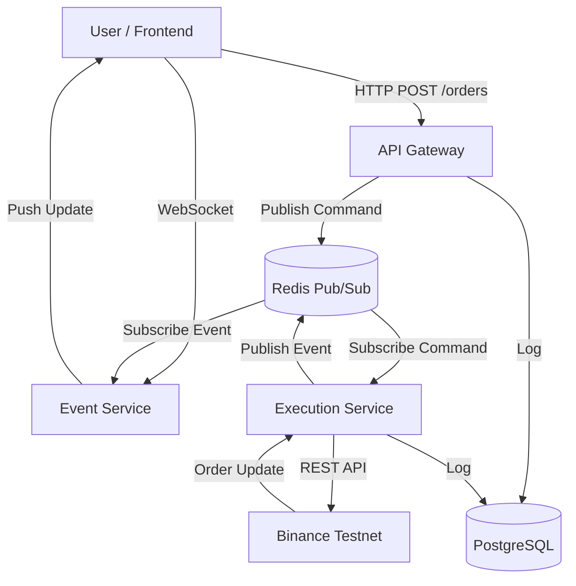

# Real-Time Trading Platform (Testnet)

A full-stack, real-time cryptocurrency trading platform built with event-driven architecture. This system demonstrates microservices design, WebSocket-based real-time updates, and proper separation of concerns for scalable trading applications.

**TESTNET ONLY:** This platform uses Binance Testnet and virtual funds. Not for production use.

---

## 🚀 Live Deployment

- **Frontend:** https://novatrade-frontend.vercel.app
- **Backend API:** https://novatrade-backend.onrender.com
- **Execution Service:** https://novatrade-execution.onrender.com
- **Event Service (WebSocket):** wss://novatrade-events.onrender.com

---

## 🏗️ Architecture Overview

### System Design Diagram


```mermaid
graph TD
    User[User / Frontend] -->|HTTP POST /orders| API[API Gateway]
    User -->|WebSocket| Event[Event Service]

    API -->|Publish Command| Redis[(Redis Pub/Sub)]

    Redis -->|Subscribe Command| Exec[Execution Service]
    Exec -->|REST API| Binance[Binance Testnet]

    Binance -->|Order Update| Exec
    Exec -->|Publish Event| Redis

    Redis -->|Subscribe Event| Event
    Event -->|Push Update| User

    API -->|Log| DB[(PostgreSQL)]
    Exec -->|Log| DB
```

---

### Key Architectural Decisions

#### 1. Event-Driven Architecture (Redis Pub/Sub)

- **Decision:** Decoupled order placement from execution using Redis.
- **Reasoning:** Prevents the API from blocking during external calls to Binance.
- **Trade-off:** Asynchronous state handling adds complexity but improves scalability.

#### 2. Separate Execution Service

- **Decision:** Isolated Binance communication in a dedicated worker.
- **Reasoning:** Allows independent scaling and isolates third-party latency or rate limits.

#### 3. Event Broadcasting Service (WebSocket)

- **Decision:** Dedicated WebSocket service for real-time updates.
- **Reasoning:** WebSockets are stateful and resource-intensive; isolation avoids API slowdown.
- **Optimization:** Single WebSocket connection per user for all updates.

#### 4. Monorepo Structure

- **Decision:** Used NPM Workspaces.
- **Reasoning:** Enables shared TypeScript types across frontend and backend for end-to-end type safety.

---

## 📁 Repository Structure

```
trading-platform/
├── apps/
│   ├── backend/              # Express.js API Gateway
│   ├── execution-service/    # Order execution worker (Web Service)
│   ├── event-service/        # WebSocket real-time service
│   └── frontend/             # Next.js 14 UI
│
├── packages/
│   └── shared/               # Shared TypeScript types
│
├── docker-compose.yml        # Local infrastructure
└── README.md
```

---

## 🛠️ Setup Instructions

### Prerequisites

- Node.js 18+
- Docker & Docker Compose (for local PostgreSQL + Redis)
- Binance Testnet API keys ([Get here](https://testnet.binance.vision))

---

### 1. Clone & Install

```bash
git clone https://github.com/Rishabhjain2003/NovaTrade-Testnet-Terminal.git
cd NovaTrade-Testnet-Terminal/trading-platform
npm install
```

---

### 2. Start Local Infrastructure

```bash
docker-compose up -d
sleep 5
```

---

### 3. Environment Variables

Create `.env` files in each service using `.env.example` as reference:

- `apps/backend/.env`
- `apps/execution-service/.env`
- `apps/event-service/.env`
- `apps/frontend/.env.local`

**Required variables:**

| Variable | Description |
|---|---|
| `DATABASE_URL` | PostgreSQL connection string |
| `REDIS_URL` | Redis connection string |
| `JWT_SECRET` | Secret for JWT signing |
| `ENCRYPTION_KEY` | Exactly 32 characters |

---

### 4. Database Setup

```bash
npm run db:generate
npm run db:push
```

---

### 5. Run Locally

Open **four terminals** and run:

```bash
# Terminal 1 - API Gateway
npm run dev:backend

# Terminal 2 - Execution Worker
npm run dev:execution

# Terminal 3 - WebSocket Event Service
npm run dev:events

# Terminal 4 - Frontend
npm run dev:frontend
```

Frontend runs at: http://localhost:3000

---

## 📚 API Documentation

### Authentication

- `POST /auth/register`
- `POST /auth/login`

---

### Trading

- `POST /api/trading/orders` — Returns `PENDING` immediately; execution is async
- `GET /api/trading/orders`
- `GET /api/trading/positions`

---

### WebSocket

**Connection:**

```
wss://novatrade-events.onrender.com?token=<JWT>
```

**Events received:**

- `PRICE_UPDATE`
- `ORDER_UPDATE` — status: `PENDING` | `FILLED` | `REJECTED`
- `CONNECTED` — on successful connection

---

## ☁️ Deployment

Deployed using **Render** (backend services) and **Vercel** (frontend).

| Service | Platform | Type |
|---|---|---|
| Backend API | Render | Web Service |
| Execution Service | Render | Web Service |
| Event Service | Render | Web Service |
| PostgreSQL | Render | Managed DB |
| Redis | Render | Key Value |
| Frontend | Vercel | Next.js |

---

## 🧠 LLM Usage Disclosure

**Estimated Usage: ~20%**

- Architecture and service boundaries designed manually
- LLM used for boilerplate setup and debugging Redis/TypeScript issues
- Core trading logic and WebSocket state handling written manually

---

## 🔮 Future Improvements

1. Replace Redis Pub/Sub with Redis Streams or BullMQ
2. Add Binance rate-limit handling
3. Implement Stop-Loss & Take-Profit orders
4. Add Jest unit tests and Cypress E2E tests

---

**Built by Rishabh Jain** | [GitHub](https://github.com/Rishabhjain2003)
